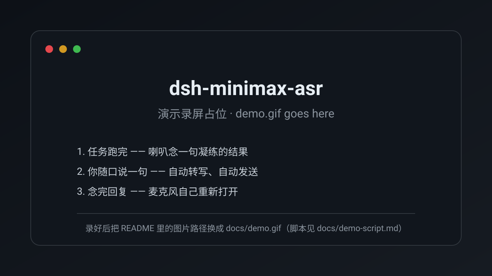

# dsh-minimax-asr

MiniMax speech-to-text (`asr-1.0`) and text-to-speech (`speech-2.8-hd`) as a
**global** DeepSeek Harness plugin: model-facing `transcribe_audio` and
`announce_speech` tools, a settings card, voice input in the composer, spoken
announcements, and handsfree conversation.

English | [中文](README.md) | [Changelog](CHANGELOG.md) | **v0.2.1**

## 30-second demo

<!-- Once you have recorded it, replace the next line with:
      -->



**The task finishes → the speaker reads one distilled sentence → you say something → it is transcribed and sent for you → the reply is read out, and the microphone reopens by itself.** No keyboard, no mouse.
(The part people remember: **what is spoken is a line written for the ear, not a reading of the reply**.)

> Want to record your own? The shot list is in [`docs/demo-script.md`](docs/demo-script.md).

## What it adds

| Surface | Detail |
| --- | --- |
| Tool | `transcribe_audio(path, language?, response_format?, timestamp_level?)` |
| Endpoint | `POST <baseURL>/v1/speech_to_text` (multipart, default `model=asr-1.0`) |
| Credential | reference `MINIMAX_API_KEY` by default, resolved per request through the credentials seam |
| Settings | namespace `minimax-asr`: `apiKeyEnv`, `baseURL`, `model`, `responseFormat`, `language`, `timestampLevel`, `maxRecordSeconds`, `maxFileMB`, `timeoutMs`, `speakEnabled`, `ttsModel`, `ttsVoice`, `ttsSpeed`, `speakMaxChars`, `voiceLoop` |
| Card | rendered in Settings → Plugins by `client/client.js` |
| Voice input | a microphone control in the composer tool row: record → transcribe → append to the draft |
| Announcements | when a turn finishes, the host pushes its reply to the browser, which reads it out loud (one click mutes it) |
| Handsfree | the conversation control: once a reply finishes the microphone reopens by itself, and a finished transcript is submitted with no click |

Formats MiniMax accepts: `wav`, `aiff`, `flac`, `m4a`/`alac`, `mp3`, `aac`,
`opus`, `ogg`. Not accepted: bare PCM, `webm`. A file may be at most 500 seconds
and 50 MB; MiniMax bills by the returned `duration`.

`response_format` is `json` (text + duration), `verbose_json` (adds
speaker-separated timestamped segments), `srt`, or `vtt`. `timestamp_level` is
`sentence` (default) or `word`; it is ignored for `json`.

## Install

**From GitHub** (recommended):

```sh
dsh plugin --profile web add github:moluyao/dsh-minimax-asr
```

That lands the package as a bundle layer in the profile, so it activates on the
next `dsh` start.

**From a local checkout** (development; hot-loads):

```sh
dsh plugin --profile web add <path-to-this-repo>
```

then activate it in the profile's patch layer
(`$DSH_HOME/profiles/web/cordis.patch.yml`):

```yaml
- insert:
    - id: minimax-asr
      name: 'dsh-minimax-asr'
      config:
        apiKeyEnv: MINIMAX_API_KEY
        baseURL: https://api.minimaxi.com
        model: asr-1.0
```

**One activation site only.** `dsh plugin add` also appends the package to
`dsh.profile.bundles` whenever it declares `dsh.bundle`, and a bundle layer
re-inserts `id: minimax-asr`. With the row above present that mounts the plugin
twice (two registrations of one tool name), so a patch-layer deployment keeps the
package as a dependency only. If a later `dsh plugin` invocation re-adds the
bundle row, delete the `insert` row from `cordis.patch.yml`.

The host half (tool + settings namespace) hot-loads with the patch layer, and the
host's client-module registry re-scans on every plugin mount, so both halves come
up live — reload the browser page to pick up the recomposed boot graph.

## Credential

The key never enters configuration: it is resolved per request through the
credentials seam (reference `MINIMAX_API_KEY` by default), so a value already
stored in `~/.dsh/.credentials.yaml`, or exported in the environment, is reused
with no extra setup:

```sh
MINIMAX_API_KEY=sk-...
```

## Voice input (browser)

| Step | What happens |
| --- | --- |
| Click | `getUserMedia` opens the microphone; the control turns red and counts seconds (auto-stops at 120 s) |
| Click again | The recorder stops, the blob is decoded and re-encoded as 16 kHz mono WAV, and POSTed to `/minimax-asr/transcribe` |
| Response | The transcript is appended to whatever the draft already held — once per transcript, never twice |

Chrome records `webm/opus`, which the endpoint does **not** accept, so the
browser half decodes the recording and rebuilds it as WAV before uploading. The
upload is bounded by the same `maxFileMB` the tool uses. A microphone permission
prompt is expected the first time per origin; a refusal surfaces in the control's
tooltip, and the tracks are always released.

**Recording length** defaults to **300 s (5 minutes)** and is editable under
Settings → Plugins → MiniMax ASR → *Max recording (seconds)* — anything from 10
to 500, taking effect on the **next** recording (a change never truncates one
already in progress). While recording the control shows `elapsed / cap`, e.g.
`1:23 / 5:00`, and stops itself at the cap.

MiniMax's own ceiling is **500 s per file (about 8m20s)** and it rejects longer
audio with a 400 rather than truncating, so **a 10-minute recording cannot be one
request** — 500 s is the most this plugin can offer. Size is not the constraint:
16 kHz mono 16-bit WAV is about 32 KB/s, so 500 s is ≈16 MB of the 50 MB budget.

## Announcements (host → browser)

You are rarely looking at the screen when a long turn lands, so **every finished
turn is read out through the speakers**. The point is that *the sentence spoken is
written for the ear, in that turn* — it is not a slice of the reply.

| Step | What happens |
| --- | --- |
| Named | before the turn ends the model calls `announce_speech` with one or two spoken sentences (the outcome, the number that matters, what it needs from you next); the visible reply is untouched |
| Host | subscribes to `session/event` and pushes that line at `turn/end`; a turn that passed `silent: true` says nothing |
| Push | one `announce` frame per turn over `GET /minimax-asr/events` (SSE), tagged with `source` — `spoken-line`, `reply-head`, or `silent` |
| Browser | synthesises through `speech-2.8-hd` (`POST /minimax-asr/speak`) and plays it; several announcements queue instead of overlapping |
| Mute | the speaker control at the end of the composer tool row; switching it off stops whatever is playing |

**Fallback**: a turn that names no line has only its **opening sentence** spoken
(the conclusion usually lives there) — never the whole reply. Nothing ever says
"there is more, I will skip it": an announcement long enough to need that apology
is an announcement that was not distilled, and the fix is to rewrite it shorter,
not to read half and apologise. Anything past `speakMaxChars` (default **80**) is
cut at a sentence boundary with **no explanation added**.

`announce_speech` also refuses an essay-length line (over 600 characters) with a
reason — "this is a summary of a report, not an announcement" — which forces the
distillation; that turn then falls back to its opening sentence.

The default voice is `male-qn-jingying`; the card now offers the account's 303
voices as a picker, where **Test the voice** auditions the current selection
immediately. The host half also exposes:

| Route | Purpose |
| --- | --- |
| `GET /minimax-asr/events` | the announcement stream (SSE) the browser half subscribes to |
| `POST /minimax-asr/speak` | `{ "text": "..." }` in, `audio/mpeg` bytes out |

`GET /minimax-asr/diagnostics` reports `listeners`, which is the direct answer to
"how many browsers are currently listening for announcements?".

**Autoplay**: a browser only allows audio after the page has had one user
interaction. You type in this page, so it normally just plays; if it is blocked,
the card says so and a click anywhere on the page clears it.

## Handsfree conversation

The rightmost control in the composer tool row is the conversation switch. One
click starts an exchange that needs no keyboard and no mouse:

| Step | What happens |
| --- | --- |
| You talk | the microphone opens by itself; the level gate decides when the turn is over — pausing mid-sentence does not count, 1.2 s of silence does |
| You stop | the recording is transcribed and **the message is sent for you** (the transcript replaces the draft, so nothing you typed earlier rides along) |
| It thinks | the microphone is shut while the agent works — otherwise it would record the speakers |
| It answers | the moment the reply finishes playing, the microphone **reopens by itself** for your next sentence; the exchange count rides the control |
| Nothing said | a full 30 s without speech releases the microphone and pauses the loop (the control says "nothing was said, click to listen again") instead of holding the mic open or uploading silence |
| A cancelled turn | the host still pushes a frame with no text: nothing is spoken, but the loop re-arms instead of waiting forever |

The gate is adaptive: it measures the room, takes the larger of "3x the noise"
and an absolute floor of 0.0025, and caps itself at 0.03 — so a quiet built-in
microphone array works and a loud room does not deafen the loop. The measured
numbers (`level`, `floor`, `gate`, `loudest`) are reported once a second to
`GET /minimax-asr/diagnostics`, so a mis-tuned gate is visible from outside the
browser.

## Voices

The card's voice field is a **picker**, not a text box: the host half fetches the
account's catalogue from MiniMax (`POST /v1/get_voice` — 303 system voices in
testing), groups it by language (Mandarin / Cantonese / English / Japanese /
Korean / …), and caches it for 10 minutes. A failed fetch falls back to a
built-in shortlist so the picker always works. A cloned voice, or any id that is
not in the catalogue, goes through "Custom voice id…".

**Test the voice** auditions whatever the picker currently shows, saved or not,
so you can try voices until one fits and only then save. Under the hood
`/minimax-asr/speak` takes optional `voice`/`speed` overrides.

## Local routes

All five routes live under one fenced prefix — loopback `Host`, no cross-site
marker, matching `Origin`, the posture the shipped `/api` gateway and the
installed `dsh-better-sidebar` use (a DNS-rebinding/cross-site defense, not
authentication):

| Route | Purpose |
| --- | --- |
| `POST /minimax-asr/transcribe` | one recording in (an `audio/wav` body, optional `?format=`, `?level=`, `?language=`, `?name=`), transcript out |
| `GET /minimax-asr/events` | the announcement stream (SSE): one `announce` frame per finished turn (a cancelled turn carries no text, which re-arms the handsfree loop) |
| `POST /minimax-asr/speak` | one line synthesised (optional `voice`/`speed` overrides), returned as `audio/mpeg` |
| `GET /minimax-asr/voices` | the account's voice catalogue as `{id, name, group}`, cached |
| `GET /minimax-asr/diagnostics` | the browser half's wiring report and measured levels: `applied`, `card-registered`, `mic-registered`, `mic-rendered`, `speaker-registered`, `speech-listening`, `announce-received`, `spoke`, `voice-registered`, `voice-control-rendered`, `voice-loop-listening`, `voice-submitted`, `mic-level` (bounded, in memory, no secrets) |
| `POST /minimax-asr/diagnostics` | how the browser half files those reports |

`GET /minimax-asr/diagnostics` is the fastest way to answer "is the browser half
loaded, did its controls mount, and is the speaker wired?" on a live deployment.

## Verifying without the harness

```sh
MINIMAX_API_KEY=... node tests/smoke.mjs <audio-file> [response_format] [timestamp_level]
MINIMAX_API_KEY=... node tests/route-smoke.mjs <audio-file>
node tests/client-smoke.mjs
node tests/installed-check.mjs <profile-dir>
```

`tests/smoke.mjs` loads `lib/index.js`, runs `apply` against a stub context, and
executes the registered tool against the live endpoint. `tests/route-smoke.mjs`
drives the registered route with synthetic node requests: every fence and size
refusal, the diagnostics channel, a completed turn becoming one `announce` frame
(a cancelled turn staying silent, and a hang-up dropping the listener), plus one
real transcription and one real synthesis. `tests/client-smoke.mjs`
loads `client/client.js` the way the browser does (a classic script calling
`window.__ModuleLoader__.load`) under a stub React/module table, asserts the card's
render and the exact path ops it writes, and runs the whole microphone pipeline
with only the codec and the network faked — asserting the uploaded WAV's header,
rate, and sample count. It then drives the whole announcement chain: SSE frame →
synthesis request → playback → queueing → mute → mid-sentence interrupt → recovery
after a failed synthesis. `tests/installed-check.mjs` resolves the *installed*
package from the profile and asserts everything the host's client-package scanner
needs (`dsh.client.platform`, `./client` bytes, the bundle id, every declared
inject, the host half's export shape) plus the single-activation-site invariant.

## Verified

- Real transcriptions through `asr-1.0`: `json`, `verbose_json` with word-level
  segments and speakers, and `srt` — through the tool *and* through the local route.
- A fresh child agent inside the running Harness saw `transcribe_audio` in its
  registry and transcribed a file with it.
- The settings card rendered in a real browser on a throwaway profile composed
  from the same bundles: 8 fields resolved from the namespace, the credential
  badge read `已配置`, an edit raised "未保存", and **Save** wrote
  `minimax-asr: / language: zh` into the profile's `settings.yaml`. That run is
  also what caught a real defect — the card read `ctx.remote` while declaring only
  `remote.credentials`, which Cordis rejects ("cannot get property \"remote\"
  without inject").
- The voice control rendered in a real session's composer tool row
  (`aria-label="用 MiniMax 语音识别听写"`, `supported: true`), confirmed both in the
  DOM and by the deployment's own `GET /minimax-asr/diagnostics` report. It appears
  once a session is bound to a workspace; a workspace-less hero composer does not
  mount that zone.
- The microphone pipeline (record → decode → 16 kHz mono WAV → route → draft) runs
  green in `tests/client-smoke.mjs` with only the codec and the network faked.
- The announcement chain is verified on both sides: the host turns one completed
  turn into a real SSE frame (`route-smoke`), and real MiniMax TTS comes back
  through `/minimax-asr/speak` as 33 KB of `audio/mpeg`; the browser side (frame →
  synthesis → playback → queue → mute → interrupt → recovery) runs green in
  `client-smoke`. That run also caught two real defects: a failed synthesis was
  immediately masked by the "queue drained" idle write, and an interrupted
  playback never settled, which wedged the controller so no later announcement was
  ever spoken.
- The handsfree loop runs green in `client-smoke`: 30 s of silence releases the
  microphone without uploading, speech followed by silence ends the turn and
  submits by itself, a finished reply reopens the microphone, a cancelled turn
  still re-arms it, and switching off releases the microphone immediately. That
  run caught three more real defects: a loud first frame could raise the gate
  above the speaker's own voice (the loop went deaf), switching off while the
  microphone was still opening left it recording, and the state machine had no
  re-entrancy guard (unbounded recursion).
- The catalogue and the audition are verified against the live API:
  `POST /v1/get_voice` returns 303 system voices, `/minimax-asr/voices` serves
  them grouped, and the `voice`/`speed` override on `/minimax-asr/speak`
  synthesises real audio (`female-tianmei` → 21 KB of `audio/mpeg`).

Not verified end to end in a browser: an actual spoken recording. Chrome reports
`microphone: prompt` for a fresh origin, and granting that is the user's gesture.

## Notes

- The plugin runs in the Harness host process and reads the audio file itself, so
  the agent's file sandbox does not gate that read. Point it at a file the host
  can already read.
- A plugin cannot appear in the model/provider picker: MiniMax ASR has no
  chat-completions interface, so it is a tool, not a conversation model.
- **A long-running instance needs one restart after a browser-half edit.** The
  client bundle's bytes are read and revisioned when the module registry first
  activates the package, and a page reload alone keeps serving the old bytes. The
  host half has no such constraint: a settings or tool change reaches the next
  call without any reload.

## License

MIT
